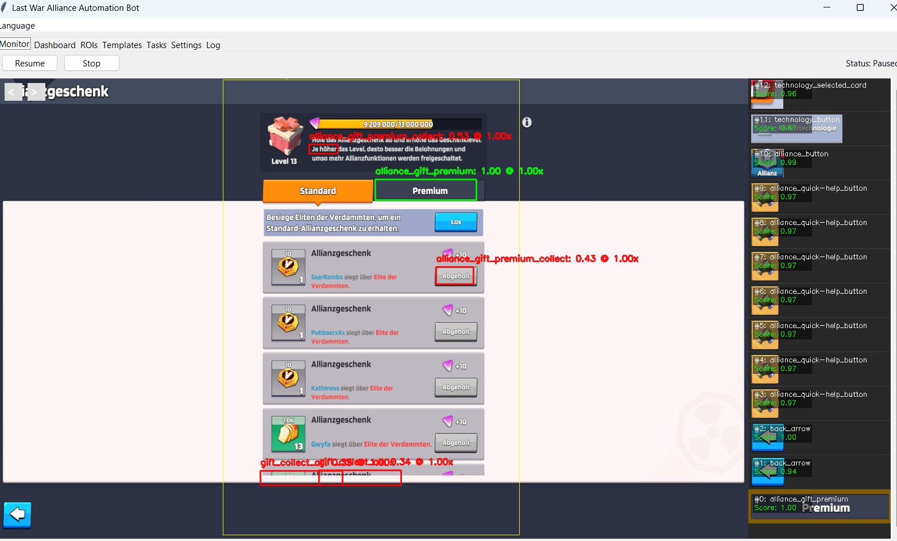
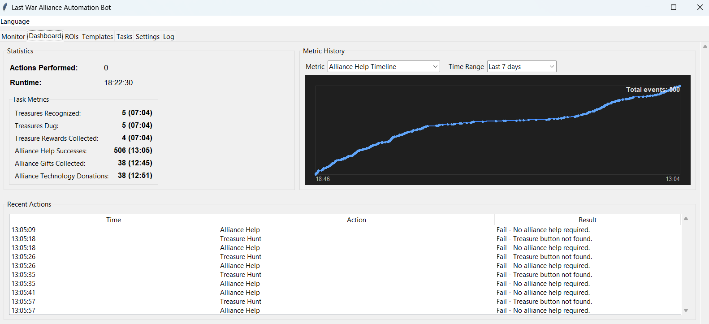
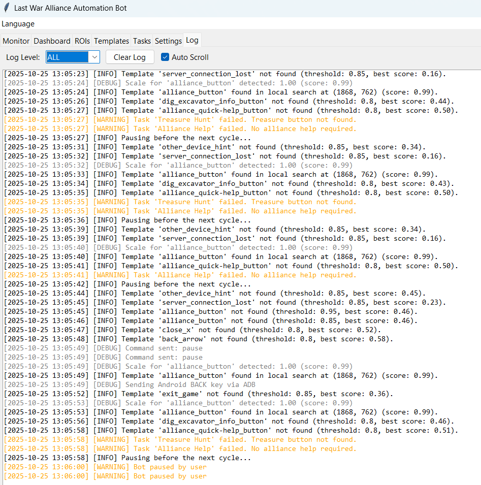

# Universal Game Automation Bot

A configurable computer-vision assistant for automating repetitive activities in mobile or PC games. The bot combines OpenCV template matching, a Tk/OpenCV hybrid GUI, and a flexible workflow engine so you can build and share game-specific automation packs without touching the core code.





Documentation files were added to the `docs/` folder. See `docs/en.md` and `docs/de.md` for full installation and usage instructions.

---

## Highlights

- **Workflow driven** – Define automation flows in profiles `tasks.yaml` with ordered steps, triggers, and per-action metadata. Import, edit, and reorder tasks visually inside the Tasks tab.
- **Template collections** – Each template key can track up to 10 reference images. Manage, preview, and capture replacements directly from the Templates tab (including screenshot + crop tooling).
- **Profile-aware configs** – Keep complete game setups (config, tasks, templates) under `profiles/` and switch between them from the Settings tab for Multi-Game Support.
- **Dual control backends** – Use Android emulators/device via ADB or drive a Windows window.
- **Monitor Interface** – Hybrid Tk/OpenCV monitor with heatmap overlays, history scrubbing, real-time dashboard, and structured log viewer.
- **Safety & recovery** – Centralised error handling and home-screen stabilisation routines keep automation loops resilient.
- **Statistics** - Stats can be dynamically defined and stored in a sqlite Database. Even if you close the Bot, the Data will be there for maximum 30 Days. 

---

## Requirements

- Python 3.9 or newer
- OpenCV and Pillow (installed via `requirements.txt`) - these need maybe other Tools for Windows to be installed like make Tools for Windows.
- For Android control: Android SDK platform tools (`adb`) on PATH
- For Windows control: `pyautogui`, `pygetwindow`, and Pillow

---

## Quick Start

```bash
git clone https://github.com/flyinghuman/gamebot.git
cd gamebot
python -m venv .venv
source .venv/bin/activate  # Windows: .venv\Scripts\activate
pip install -r requirements.txt
python3 bot.py # Start the Bot or run start-bot.bat
```

1. Edit `profiles/my-game/config.yaml` to match your device backend, thresholds, ROIs, and other preferences.
2. Drop your template images into `profiles/my-game/templates/` (each template key may reference up to 10 files).
3. Adjust `profiles/my-game/tasks.yaml` to describe the workflows you want to run.
4. Start the bot and choose your profile from *Settings → Configuration Profile* (or update `profiles/active_profile.txt`).
   ```bash
   python bot.py
   ```
5. Use the GUI tabs to monitor activity, tweak settings, capture templates, and maintain your task library.

---

## Profile Sets

Each profile bundles a complete bot setup under `profiles/<name>/`:

- `config.yaml` – settings, ROIs, and general behaviour
- `tasks.yaml` – workflow definitions for the task engine
- `templates/` – template images referenced by the profile config

Select the active profile from the Settings tab or by editing `profiles/active_profile.txt`. Sharing a profile is as simple as zipping its folder and distributing it to other users.

---

## Configuration Guide

Each profile ships with a `config.yaml` that drives almost every runtime behaviour. Each entry stores both `value` and `comment` to ease editing. Key sections include:

- **`bot_title` / `language`** – Sets the window caption and default GUI language.
- **`control_mode`, `windows_title`, `device_serial`** – Select Android (`adb`) or Windows control and supply identifiers.
  - In Adnroid Mode an Emulator like Bluestacks with enabled ADB is required. Android Mode is the recommented Mode because you can use your PC normally beside the Bot and even Lock the Screen.
  - In Windows Mode the Bot sends Mouse klicks into the Game Window and you MUST STAY LOGIN in Windows so that the Bot can click in the Window. Using your Windows is not possible because the Bot grab your Mouse and clicks into the Window.
- **`template_scale_test`** – Optional auto-scaling probe to compensate for resolution changes.
- **`rois` & `templates`** – Normalised ROIs and template metadata. Replace these entries with assets from your target game.
- **`tasks_file`** – Path to the workflow definition file (defaults to `tasks.yaml`).

A matching `config.yaml` is included for LastWar Survival Game (TM) to get a quick bootstrapping.
This Project is not related with LastWar Survial Game - it uses it only as reference. This is a Universal Game Bot - you can use it also for other Games which can be automated through Picture Recognition and automated requrring Tasks.

---

## Managing Templates

The Templates tab lets you:

- List every template key defined in `config.yaml`.
- Attach up to ten images per key, reorder them, or remove obsolete samples.
- Preview each asset and view the ROI used for matching.
- Capture a screenshot from the active control backend, crop the relevant region, and store it as a new or replacement template image.

Changes can be saved back to `config.yaml` so they are available to other users.

---

## Building Workflows (`tasks.yaml`)

Workflows describe automation sequences and are stored in `tasks.yaml` (configurable path). Each task contains:

- `id`, `name`, `description`, `enabled`
- `trigger` block (currently interval-based with optional randomisation and run-at-start flag)
- `steps` array. Built-in step types now cover taps, waits, logging, flag/detail management, nested `if / else` branches, loops, task chaining, and utility actions like `press_back`. Template-oriented steps use a dropdown fed by the active profile so you never mistype a key.

The Tasks GUI tab offers full CRUD, reordering, duplication, validation, and persistence for these definitions, including nested step editors and a visual condition builder.

---

## Long Tap Support

`find_and_tap` now accepts an optional `duration` argument (milliseconds). When provided, the bot issues a swipe with identical start/end coordinates to emulate a long press. The helper `wait_and_tap` defaults to short taps but can receive a `duration` override for controls that require holding.

---

## Troubleshooting

- **No templates detected** – Verify file paths in `config.yaml` and confirm images were captured at the current resolution. The Templates tab preview highlights any missing files.
- **Window not found** – Ensure the `windows_title` entry matches the actual window caption (partial matches are supported by `pygetwindow`).
- **ADB timeouts** – Confirm the device appears under `adb devices` and increase `template_scale_test` thresholds.
- **Task errors** – The log tab highlights validation issues. You can inspect `tasks.yaml` to confirm each step type and parameter.

---

## License

This project is released under the GNU GPLv3. See `LICENSE` for the full text.

## Documentation

More detailed user and developer documentation is available under the `docs/` folder:

- `docs/en.md` — English documentation (installation, Bluestacks, GUI, task authoring, examples)
- `docs/de.md` — German documentation (same content, translated)

Please read the docs for platform-specific setup steps and the Tasks how-to.

## Support the project

If you find this project useful and want to support continued development, please consider making a small donation to the developer. There is no required donation — but contributions help with maintenance and improvements.

Thank you for supporting the project!
```text
BTC: bc1qydkjt2gfxr7uz4pt4jldpzwxqty8nc76vtv9ss
ETH: 0x5D0F170eBc8caC2db4F9477E26A4858142abDEEB
XRP: rUvTGRaqg9Q7DTJoMRGRVBZ1fpKaZQcx5a
DOGE: DRPr2oh2ynd4FJ66BrPFfskE1jpEWWnBpm
DASH: Xnzed2r417hGfgLG4DqCCTSNPci6FbvgHW
```